---

Increase the visibility of your app with a beautiful landing page and take your app to the next level by integrating required and engaging content.

# iOS SDK

### Focus on your core business and let apprack handle the rest.

The apprack iOS SDK allows to keep focus on your core business by taking over all the screens you need, but don't want to spend time working on, such as screens for terms of use, privacy policy, release notes, settings …

All you need to use the SDK is an account on [apprack.io](https://apprack.io).  

**[Get started now](https://apprack.io/users/sign_up)**

[apprack.io](https://apprack.io) is also able to generate a landing page for your app to help you promote and market it.  
Go to [apprack.io](https://apprack.io) to learn more.

## Included in the SDK

The apprack iOS SDK includes various screens and features. You can use all of them or only one – every combination is possible. 
You can use the settings controller, which links to all other provided screens. You're also able to just use the screen for the privacy policy or use the settings screen only to promote your other apps.

### Screens

* Settings Screen
	- Automatically links to your app settings in the iOS settings if your app requests any of the privacy categories (photos, calendar, contacts, …)
	- Links to the ratings screen in the App Store
	- Includes version number (also alerts the user whenever there is a new update available)
	- Links to your social media profiles (Twitter, Facebook, Instagram, …)
	- Promotes your other apps
	– Integrates all other screens included in the SDK
	- Can be extended using custom sections or completely custom `UIView`s
* Support Form
* Release Notes
	- Fully automated release notes, always in sync with your App Store releases. apprack.io knows when your version goes live and gets the release notes for the latest version directly from the App Store.
* Legal Screens
	- Terms of use
	- Privacy policy
	- Imprint
	
### Features

* Check for available updates
	- The SDK can check for a newer version on the App Store and ask the user to update
	- The release notes of the new version can be directly linked to create a greater incentive to update
* Ask for reviews
	- The SDK can ask the user for an App Store rating and review using the official `SKStoreReviewController` provided by Apple
	- Use the settings on apprack.io to specify when to prompt your users (by required app launches, days since first install, …)


---


# How do I use it?

We strongly recommend to install the SDK using [CocoaPods](http://cocoapods.org).

## Installing with Cocoapods

The iOS SDK is available through [CocoaPods](http://cocoapods.org).

To install, simply add the following line to your Podfile:

```ruby
pod 'apprack-io'
```

## Authenticate your app

When your app launches it needs to authenticate itself with apprack.io to be able to include the required content.
To do this just call `-initializeWithAppKit:andApiKey:` in `-application:didFinishLaunchingWithOptions:`

**Objective-C**  
```objc
- (BOOL)application:(UIApplication*)application didFinishLaunchingWithOptions:(NSDictionary*)launchOptions {
    NSString* appKit = @"415a4162-f52a-4b7b-bc02-b582e535dc56";
    NSString* apiKey = @"4vzHzK6WaUsnonCG715QYQ";
    [APRAppManager.sharedManager initializeWithAppKit:appKit andApiKey:apiKey];
    return YES;
}
```

**Swift**  
```swift
func application(_ application: UIApplication, didFinishLaunchingWithOptions launchOptions: [UIApplicationLaunchOptionsKey: Any]?) -> Bool {
    let appKit = "415a4162-f52a-4b7b-bc02-b582e535dc56"
    let apiKey = "4vzHzK6WaUsnonCG715QYQ"
    APRAppManager.shared().initialize(withAppKit: appKit, andApiKey: apiKey)
    return true
}
```

## Present screens

To show a screen provided by the SDK, use the properties of `APRAppManager` (such as `settingsViewController`, `imprintViewController`, `changelogViewController`, …).
All screens are expected to be presented in a `UINavigationController`.

#### Present modally

**Objective-C**  
```objc
UINavigationController* navigation = [[UINavigationController alloc] initWithRootViewController:APRAppManager.sharedManager.settingsViewController];
[self presentViewController:navigation animated:YES completion:nil];
```

**Swift**  
```swift
let navigation = UINavigationController(rootViewController: APRAppManager.shared().settingsViewController)
self.present(navigation, animated: true, completion: nil)
```

#### Push on existing navigation controller

**Objective-C**  
```objc
[self.navigationController pushViewController:APRAppManager.sharedManager.settingsViewController animated:YES];
```

**Swift**  
```swift
self.navigationController?.pushViewController(APRAppManager.shared().settingsViewController, animated: true)
```

### Settings screen

The best way to include all screens provided by the SDK is to include the provided settings screen. Other screens, such as support form, release notes, privacy policy, legal notes and imprint are accessible from the settings. 

#### Customize

You are able to customize which content is displayed or linked using the SDK section on apprack.io.

There are several color properties on `APRSettingsViewController` to customize the appearance of the settings screen to perfectly adapt it to your app's color scheme.

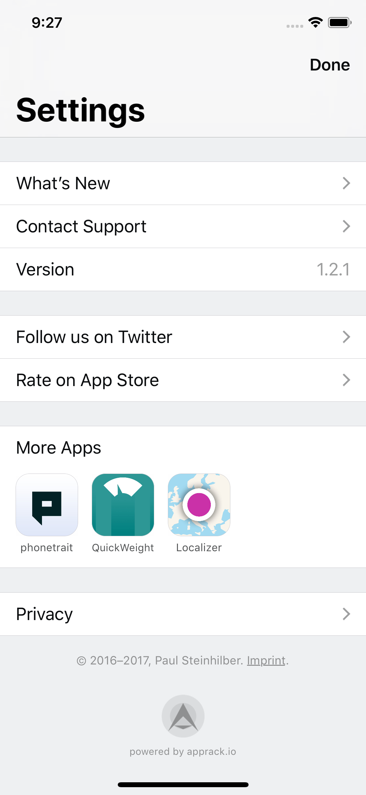 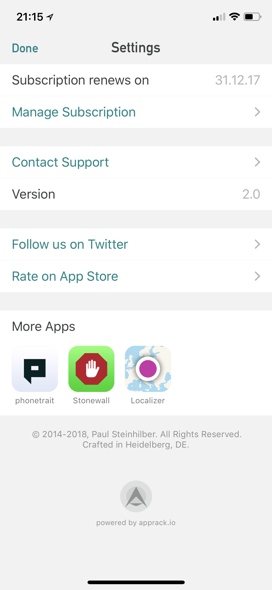 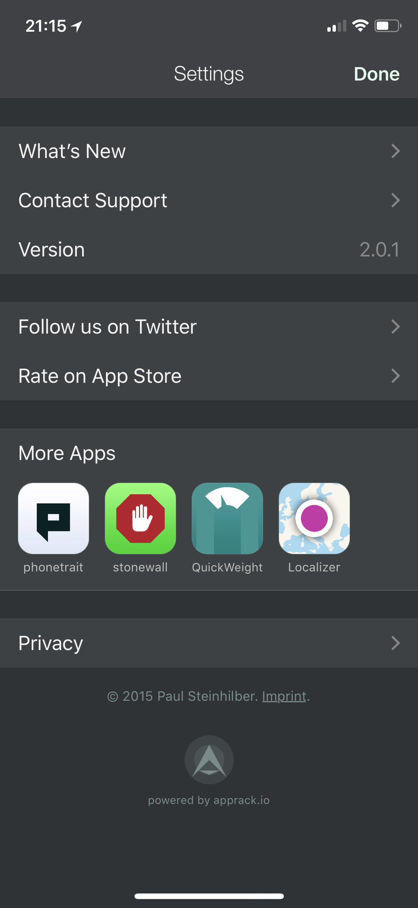

- **`backgroundColor`**
  - `UIColor` property to set the background color for the controller.
- **`cellBackgroundColor`**
  - `UIColor` property to set the background color for cells.
- **`borderColor`**
  - `UIColor` property to set the border color for cells.
- **`finePrintColor`**
  - `UIColor` property to set the color of the copyright information and imprint link.
- **`textColor`**
  - `UIColor` property to set the text color for cells.
- **`cellSpacing`**
  - Property to specify the space between cells.
- **`sectionSpacing`**
  - Property to specify the space between sections.
- **`privacySettingsLinkEnabled`**
  - Property to dis/enable if the settings screen should include a link to your app's settings section in the iOS settings app. If enabled, it is only shown if your app requests access to content listed in the settings app (e.g. contact, calendars, location, …)

#### Extend

You can extend the settings screen with your own views. Or use one of our provided functions to add cells with custom content and actions.

- To extend the settings screen by providing your own views, add a view using `-addCustomView:` on `APRSettingsController`.
Custom views are dislayed on top, before all predefined cells. 
- Or choose to extend the settings screen using one of our predefined cells:
  - `-addCellWithTitle:`
    - 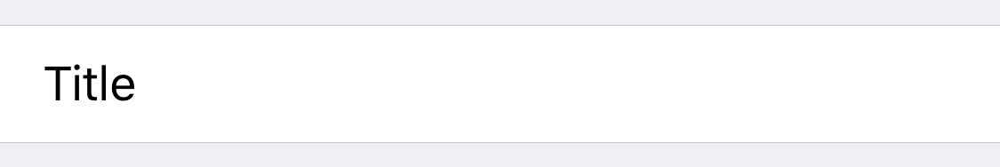
  - `-addCellWithTitle:andCallbackHandler:`
    - 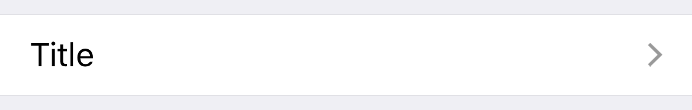
  - `-addCellWithTitle:accessoryText:andCallbackHandler:`
    - 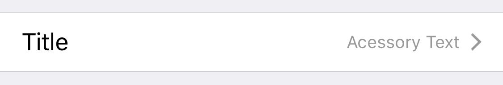
  - `-addCellWithTitle:switchValue:andCallbackHandler:`
    - 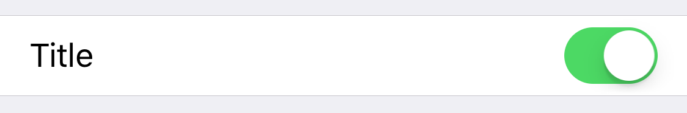
  - `-addDescriptionalText:`  
  - `-addSectionMargin:` 

#### Customized and Extented Settings Sample

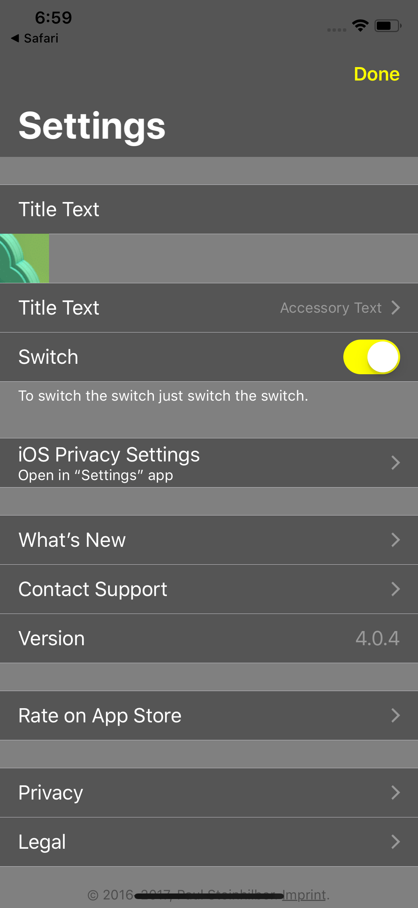

**Objective-C**  
```objc
APRSettingsViewController* settingsController = APRAppManager.sharedManager.settingsViewController;

// customize it
settingsController.backgroundColor = UIColor.grayColor;
settingsController.cellBackgroundColor = UIColor.darkGrayColor;
settingsController.textColor = UIColor.whiteColor;
settingsController.tintColor = UIColor.yellowColor;

// extend it
[settingsController addDefaultTopMargin];
[settingsController addCellWithTitle:@"Title Text"];

UIImageView* imageView = [[UIImageView alloc] initWithFrame:CGRectMake(0, 0, 44, 44)];
imageView.image = [UIImage imageNamed:@"sample"];
[imageView.heightAnchor constraintEqualToConstant:44].active = YES;
[imageView.widthAnchor constraintEqualToConstant:44].active = YES;
[settingsController addView:imageView];

[settingsController addCellWithTitle:@"Title Text" accessoryText:@"Accessory Text" andCallbackHandler:^{
    NSLog(@"Do something on selection.");
}];

[settingsController addCellWithTitle:@"Switch" switchValue:YES andCallbackHandler:^(BOOL isOn) {
    NSLog(@"Do something on value change. Switch is %@ now.", isOn ? @"on" : @"off");
}];

// present it
UINavigationController* navigation = [[UINavigationController alloc] initWithRootViewController:settingsController];
[self presentViewController:navigation animated:YES completion:nil];
```

**Swift**  
```swift
let settingsController = APRAppManager.shared().settingsViewController

// customize it
settingsController.backgroundColor = .gray
settingsController.cellBackgroundColor = .darkGray
settingsController.textColor = .white
settingsController.tintColor = .yellow

// extend it
settingsController.addDefaultTopMargin()
settingsController.addCell(withTitle: "Title Text")

let imageView = UIImageView(frame: CGRect(x: 0, y: 0, width: 44, height: 44))
imageView.image = UIImage(named: "sample")
imageView.heightAnchor.constraint(equalToConstant: 44).isActive = true
imageView.widthAnchor.constraint(equalToConstant: 44).isActive = true
settingsController.addView(imageView)

settingsController.addCell(withTitle: "Title Text", accessoryText: "Accessory Text") {
    print("Do something on selection.")
}

settingsController.addCell(withTitle: "Switch", switchValue: true) { isOn in
    print("Do something on value change. Switch is \(isOn ? "on" : "off") now.")
}

// present it
let navigation = UINavigationController(rootViewController: settingsController)
self.present(navigation, animated: true, completion: nil)
```

### Localization

The apprack SDK is currently localized for 

- English
- German

Support for more languages is in the works.  
If you provide us with your localization for a language we not yet support, you'll receive up to six months of service for free.

If you want to add your own localization, translate the keys found in `APRStrings.strings` and add it to your `Localizable.strings`.
It is also possible to only add specific strings and override our localization with your prefered wording.

## Check for available updates

The SDK can check if a newer version is available on the App Store and ask the user to update.
Optionally, the release notes of the new version can be directly linked, to create a greater incentive to update.

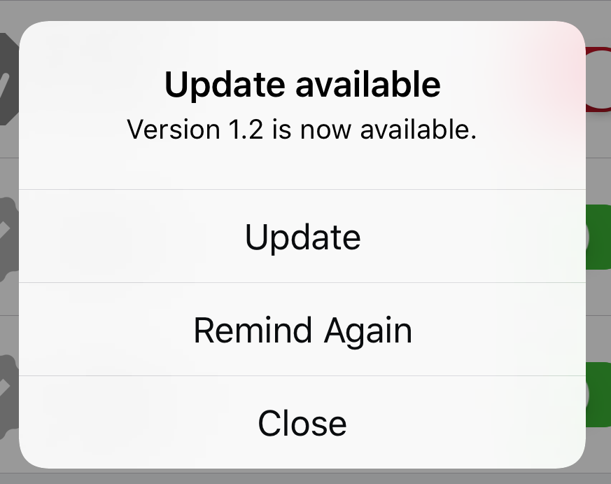 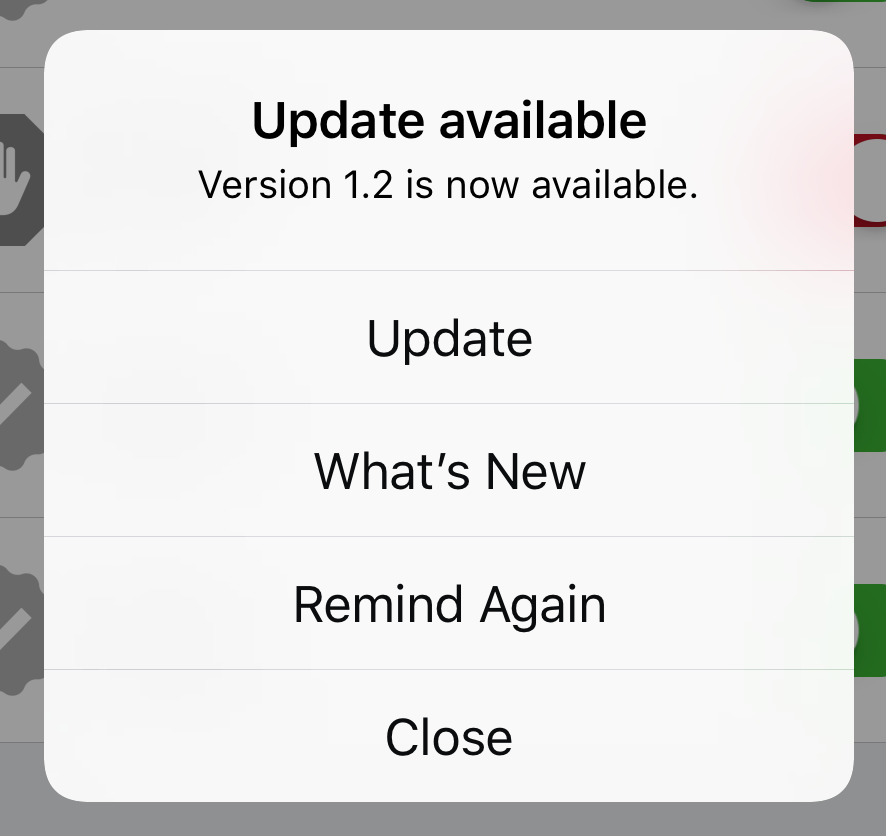

To have the SDK present an update alert you can either

* enable 'Update available alert' in the SDK configuration on apprack.io
  - In this case, the SDK checks for an available update and prompts the user automatically to update after the app launches if a newer version is available (and supported on his device).
* check manually for a newer version at another point in time
  - To do this call `-showUpdateAlertOnController:` on `APRAppManager`.
  
**Objective-C**  
```objc
[APRAppManager.sharedManager showUpdateAlertOnController:self];
```

**Swift**  
```swift
APRAppManager.shared().showUpdateAlertOnController(self)
```

## Ask for reviews

The SDK can ask the user for an App Store rating and review using the official `SKStoreReviewController` provided by Apple.
Use the settings on apprack.io to specify when to prompt your users (by required app launches, days since first install, …)

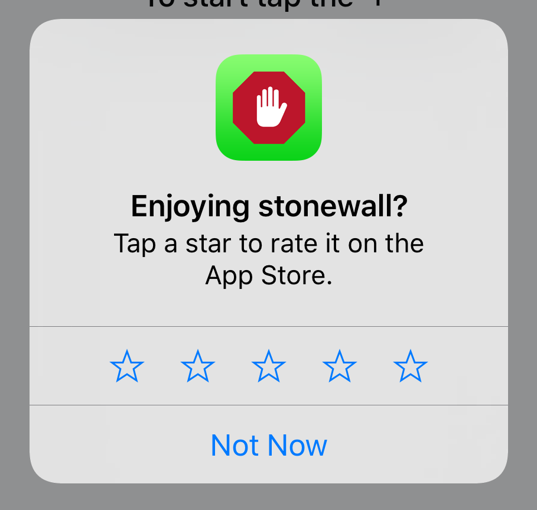

When it's a good time to ask the user for a review just call `-shouldRequestReview` on `APRAppManager`:

**Objective-C**  
```objc
[APRAppManager.sharedManager shouldRequestReview];
```

**Swift**  
```swift
APRAppManager.shared().shouldRequestReview()
```

Keep in mind, even if all checks (days since first launch, etc.) succeed, it is still not guaranteed that the review alert is shown.  
Apple limits the display of the alert to about three times per year!  
Therefore, you should not call `shouldRequestReview` on active user interaction; e.g. do not create a button 'Rate App' and call `shouldRequestReview` as in most cases nothing would happen for your user.


---


# Personal data

The SDK collects an identifier unique to each user and each app, which under the terms defined by the GDPR is personal data.
In addition, information about the app and device is collected, such as app version, iOS version, device model and type, as well as the apprack SDK's version. All data is securely processed and stored on servers in Germany. We offer a data processing agreement for your convenience.


---


# Found a bug or missing a feature?

* Create an issue on https://github.com/apprack/apprack-ios-sdk
* Contact us at support@apprack.io
